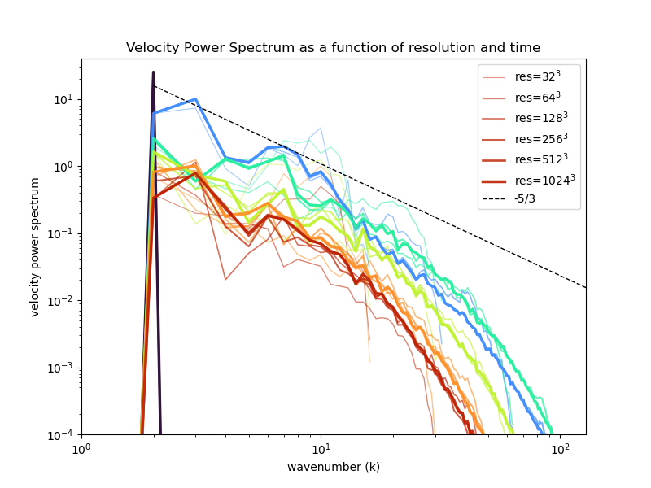

# navier-stokes-turbulence

Philip Mocz (2025)

Flatiron Institute

A simple Navier-Stokes solver in JAX
used to investigate the velocity power spectrum of turbulence
resulting from the Taylor-Green vortex
in a 3D periodic box.


## Virtual Environment

```console
module purge
module load python/3.11
python -m venv --system-site-packages $VENVDIR/navier-stokes-turbulence-venv
source $VENVDIR/navier-stokes-turbulence-venv/bin/activate
pip install --upgrade pip
pip install -r requirements.txt
```


## Run Locally

```console
python navier-stokes-turbulence.py
```


## Submit job (Rusty)

```console
sbatch sbatch_rusty.sh
```

## Analyze results

```console
python analyze.py --res 64
```

## Summarize results from multiple runs

```console
python summarize.py --res 64
```

results in the following plot:


