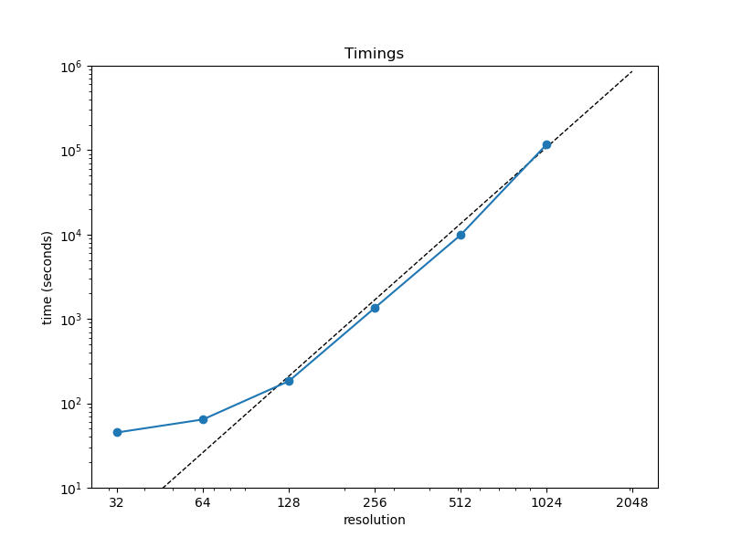

# navier-stokes-turbulence

Philip Mocz (2025)

Flatiron Institute

A simple Navier-Stokes solver in JAX
used to investigate the velocity power spectrum of turbulence
resulting from the Taylor-Green vortex
in a 3D periodic box.


## Virtual environment

```console
./venv_setup.sh
```


## Run locally

```console
python navier-stokes-turbulence.py
```


## Submit job (to Rusty)

```console
sbatch sbatch_rusty.sh
```

## Analyze results

```console
python analyze.py --res 64
```

## Summarize results from multiple runs

```console
python summarize.py --res 64
```

creates the following plots:



